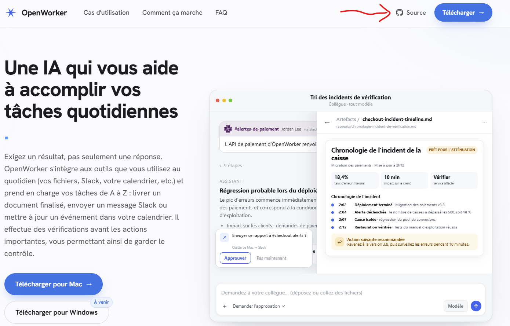
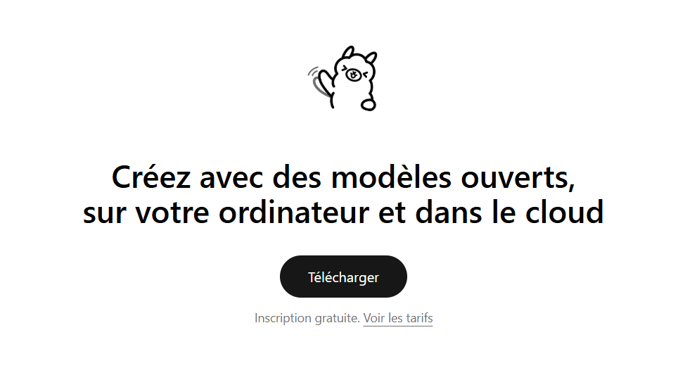
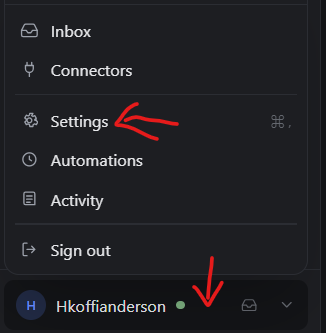
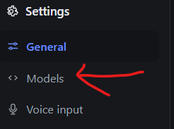
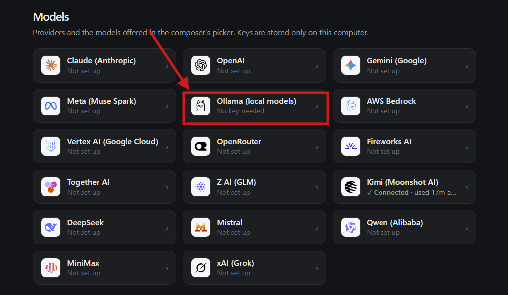
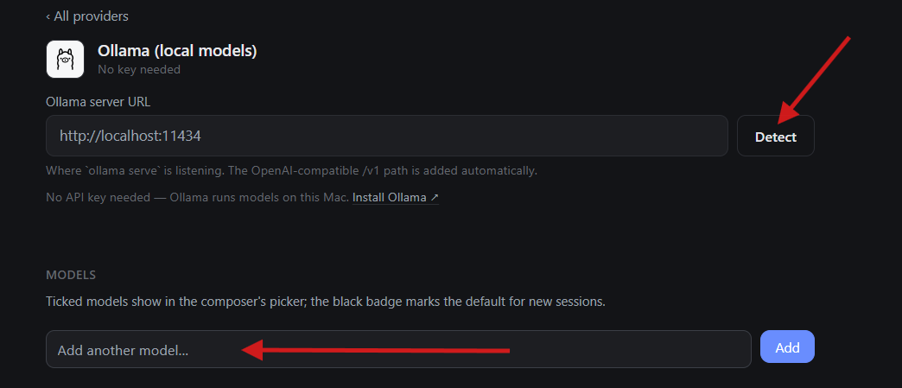
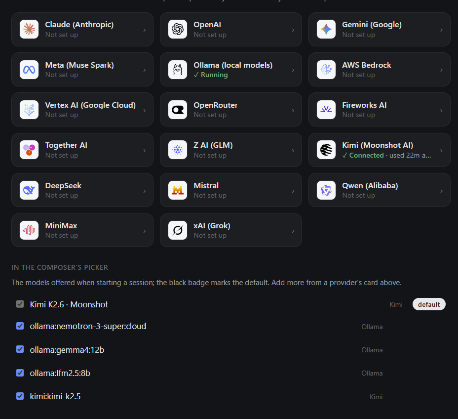
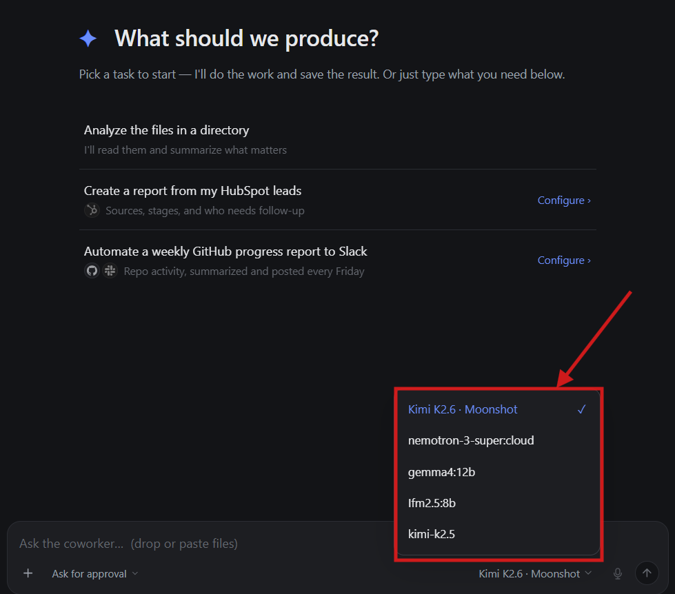
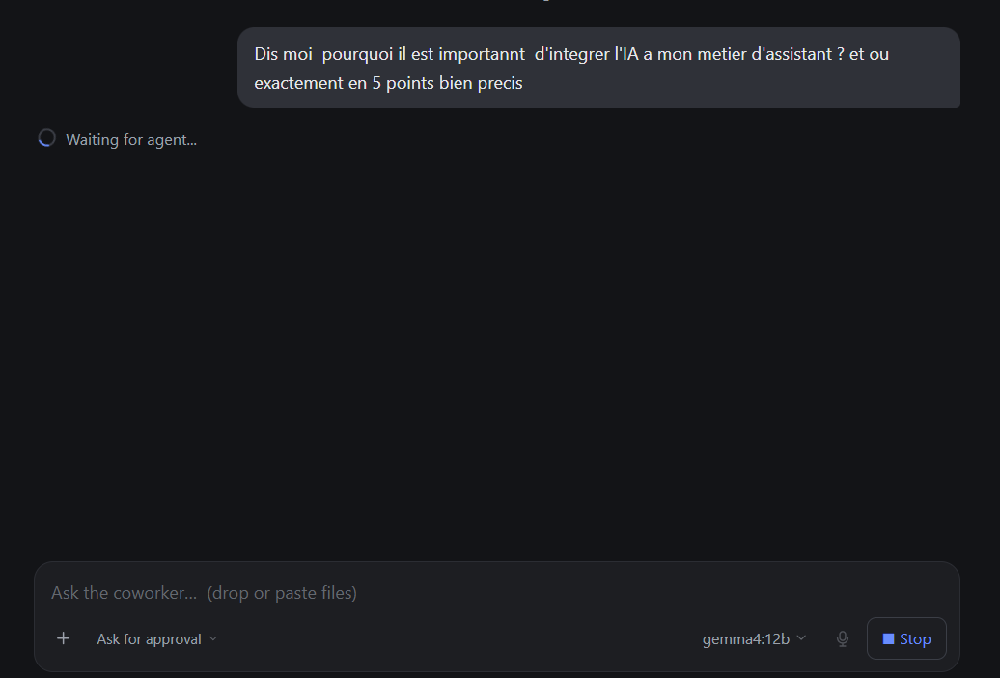
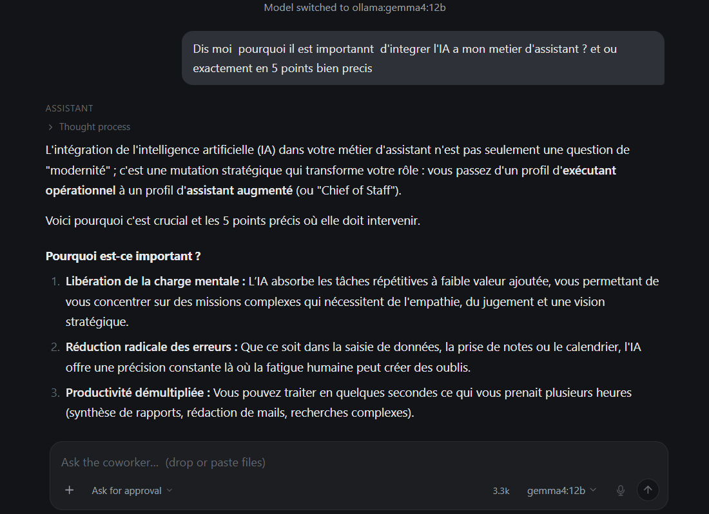

# Tutoriel OpenWorker — Installer l'app, brancher Ollama et travailler avec des modèles locaux

Ce guide vous accompagne pas à pas :

1. [Installation d'OpenWorker](#i-installation-dopenworker)
2. [Installation d'Ollama](#ii-installation-dollama)
3. [Ajout d'Ollama à OpenWorker](#iii-ajout-dollama-à-openworker)
4. [Conseils d'usage réussi](#iv-conseils-dusage-réussi)

> **À qui s'adresse ce guide ?** À toute personne (assistant·e, gestionnaire, formateur·rice, développeur·se) qui veut un assistant IA qui **produit un résultat** — un fichier, un message, un rapport — et non seulement une réponse dans un chat, tout en gardant ses données sur sa propre machine grâce aux modèles locaux.

---

## I. Installation d'OpenWorker

### 1. Télécharger le logiciel



Rendez-vous sur le site d'OpenWorker, puis **cliquez en haut à droite sur « Source »** (flèche rouge sur l'image) pour ouvrir le dépôt du projet et télécharger le paquet correspondant à **votre système d'exploitation**.

Vous pouvez également passer directement par les liens de téléchargement :

| Système d'exploitation | Lien direct | Fichier téléchargé | Taille approximative |
|---|---|---|---|
| 🍎 **macOS** (Apple Silicon) | https://download.openworker.com/mac | `OpenWorker-macos-arm64.dmg` | **≈ 70 Mo** (67 Mio) |
| 🪟 **Windows** (64 bits) | https://download.openworker.com/windows | `OpenWorker-windows-setup.exe` | **≈ 60 Mo** (57 Mio) |

*Tailles relevées le 12/08/2026 directement sur les liens de téléchargement ; elles évoluent légèrement à chaque nouvelle version.*

> 💡 Sur la page d'accueil, le bouton « Télécharger pour Windows » peut encore afficher le badge **« À venir »** : le lien direct ci-dessus fonctionne néanmoins et livre bien l'installateur Windows.

**Installer sous macOS**
1. Ouvrez le fichier `.dmg` téléchargé.
2. Glissez l'icône **OpenWorker** dans le dossier **Applications**.
3. Au tout premier lancement, faites un **clic droit sur l'application → Ouvrir** (puis confirmez), afin de contourner l'avertissement de sécurité Gatekeeper.

**Installer sous Windows**
1. Lancez `OpenWorker-windows-setup.exe`.
2. Si Windows SmartScreen affiche un avertissement : **Informations complémentaires → Exécuter quand même**.
3. Laissez l'assistant se terminer, puis ouvrez OpenWorker depuis le menu Démarrer.

### 2. Création du compte utilisateur

1. Au premier démarrage, choisissez **Sign up / Créer un compte**.
2. Saisissez votre **adresse e-mail** et un **mot de passe** (ou utilisez la connexion via votre fournisseur d'identité si elle est proposée).
3. **Confirmez votre adresse e-mail** grâce au lien reçu dans votre boîte de réception (pensez à vérifier le dossier « Spam »).
4. Reconnectez-vous : votre nom d'utilisateur apparaît alors **en bas à gauche de la fenêtre**, avec une pastille verte quand la session est active. C'est ce même endroit qui servira, plus loin, à ouvrir les paramètres.

> ℹ️ Le compte sert à la synchronisation et aux fonctions cloud. Les **clés d'API et les modèles locaux restent stockés uniquement sur votre ordinateur** — c'est d'ailleurs écrit sur l'écran des modèles : *« Keys are stored only on this computer. »*

---

## II. Installation d'Ollama

Ollama est le moteur qui fait tourner des **modèles d'IA ouverts directement sur votre machine**, sans envoyer vos données à un service externe. OpenWorker s'y connecte ensuite comme à n'importe quel autre fournisseur.

### 1. Télécharger Ollama



Rendez-vous sur **https://ollama.com/download**, puis cliquez sur **« Télécharger »**. Le site détecte votre système (macOS, Windows ou Linux) et vous propose le bon paquet. L'inscription est gratuite et n'est pas nécessaire pour utiliser les modèles locaux.

Vous pouvez également passer directement par les liens de téléchargement :

| Système d'exploitation | Lien direct | Fichier téléchargé | Taille approximative |
|---|---|---|---|
| 🍎 **macOS** (Apple Silicon et Intel) | https://ollama.com/download/Ollama.dmg | `Ollama.dmg` | **≈ 183 Mo** (175 Mio) |
| 🪟 **Windows** (64 bits) | https://ollama.com/download/OllamaSetup.exe | `OllamaSetup.exe` | **≈ 1,56 Go** (1,46 Gio) |
| 🐧 **Linux** | `curl -fsSL https://ollama.com/install.sh \| sh` | script d'installation | — |

*Tailles relevées le 13/08/2026 sur la version **v0.32.9** ; elles évoluent à chaque nouvelle version. Ces liens pointent toujours vers la dernière version publiée.*

Une fois l'installation terminée, vérifiez que tout fonctionne en ouvrant un terminal (PowerShell sous Windows, Terminal sous macOS) :

```bash
ollama --version
```

Ollama démarre un petit serveur local qui écoute sur **http://localhost:11434** : c'est précisément l'adresse qu'OpenWorker interrogera. Gardez donc Ollama lancé pendant vos sessions de travail.

### 2. Télécharger le modèle `gemma4:12b`

Vérifiez d'abord les modèles déjà présents sur votre machine :

```bash
ollama list
```

Si `gemma4:12b` n'apparaît pas dans la liste, téléchargez-le :

```bash
ollama pull gemma4:12b
```

- **Taille du téléchargement : 7,6 Go** — prévoyez une bonne connexion et au moins **10 Go d'espace disque libre**.
- **RAM recommandée : 16 Go minimum** pour un modèle de 12 milliards de paramètres.
- Le téléchargement se poursuit en arrière-plan ; s'il est interrompu, relancez simplement la même commande, il reprend là où il s'était arrêté.

Testez le modèle avant de passer à la suite :

```bash
ollama run gemma4:12b
```

Posez une question, vérifiez que la réponse arrive, puis quittez avec `/bye`.

> 💡 Vous pouvez ajouter d'autres modèles selon vos besoins (par exemple `lfm2.5:8b`, plus léger et plus rapide). Ils apparaîtront tous ensuite dans OpenWorker.

---

## III. Ajout d'Ollama à OpenWorker

### 1. Guide d'ajout

**Étape 1 — Ouvrir les paramètres**



Cliquez sur **les paramètres en bas de la fenêtre, au niveau de votre profil** (la flèche rouge du bas), puis, dans le menu qui s'ouvre, sur **« Settings »**.

**Étape 2 — Aller dans la section « Models »**



Dans la colonne de gauche des réglages, cliquez ensuite sur **« Models »**.

**Étape 3 — Sélectionner le fournisseur Ollama**



La page liste tous les fournisseurs disponibles (Claude, OpenAI, Gemini, Mistral, etc.). Cliquez sur la carte **« Ollama (local models) »** — encadrée en rouge. Notez la mention **« No key needed »** : aucune clé d'API n'est requise, puisque tout tourne sur votre ordinateur.

**Étape 4 — Détecter les modèles**



Vérifiez que l'adresse du serveur est bien `http://localhost:11434`, puis cliquez sur **« Detect »** pour détecter le modèle.

> ⚠️ **Si le modèle n'est pas détecté, lancez Ollama depuis votre PC, puis réessayez.** Le serveur doit être en cours d'exécution (commande `ollama serve`, ou simplement l'application Ollama ouverte) pour qu'OpenWorker puisse le voir. Le chemin `/v1` compatible OpenAI est ajouté automatiquement, ne l'écrivez pas dans l'URL.

Le champ **« Add another model… »** (flèche rouge du bas) permet d'ajouter manuellement un modèle par son nom, puis de valider avec le bouton **« Add »**.

**Étape 5 — Vérifier que la connexion a réussi**



Voici un exemple de **connexion réussie avec ajout de modèles** : la carte « Ollama (local models) » affiche désormais **✓ Running**, et les modèles ajoutés apparaissent cochés dans la section **« In the composer's picker »** (ici `ollama:nemotron-3-super:cloud`, `ollama:gemma4:12b`, `ollama:lfm2.5:8b`).

Les cases cochées déterminent les modèles proposés au démarrage d'une session ; le badge noir **« default »** indique le modèle utilisé par défaut.

**Étape 6 — Vérifier la présence des modèles dans le chat**



Revenez sur l'écran principal et **vérifiez que les modèles ont bien été ajoutés dans l'onglet des modèles du chat** : cliquez sur le sélecteur de modèle en bas à droite de la zone de saisie. Vos modèles Ollama (`gemma4:12b`, `lfm2.5:8b`, `nemotron-3-super:cloud`…) doivent y figurer aux côtés des modèles cloud. Sélectionnez celui que vous voulez utiliser.

### 2. Test de prompt

Une fois `gemma4:12b` sélectionné, lancez une première demande pour valider l'installation :



> **Prompt de test :** *« Dis-moi pourquoi il est important d'intégrer l'IA à mon métier d'assistant ? Et où exactement, en 5 points bien précis. »*

L'indicateur **« Waiting for agent… »** s'affiche pendant que le modèle réfléchit. Sur un modèle local, la première réponse est plus lente (le modèle est chargé en mémoire) ; les suivantes sont nettement plus rapides.

Et voici la réponse obtenue :



Le bandeau **« Model switched to ollama:gemma4:12b »** confirme que la réponse provient bien de votre modèle **local**. Vous pouvez déplier **« Thought process »** pour voir le raisonnement du modèle, et le compteur en bas (`3.3k`) indique la taille du contexte consommé.

✅ **Si vous voyez cet écran, votre installation est complète et fonctionnelle.**

---

## IV. Conseils d'usage réussi

### Bonnes pratiques

1. **Gardez Ollama lancé.** Si le fournisseur repasse en « Not set up » ou qu'une réponse échoue, c'est presque toujours qu'Ollama n'est pas démarré. Relancez-le, puis recliquez sur **Detect**.
2. **Choisissez le modèle selon la tâche.** Un modèle local (`gemma4:12b`) est idéal pour les documents confidentiels et le travail hors ligne ; un modèle cloud sera plus pertinent pour les tâches longues, très techniques ou nécessitant une recherche web.
3. **Demandez un livrable, pas une conversation.** OpenWorker est fait pour produire un résultat : dites *« rédige et enregistre le compte rendu dans `notes/reunion.md` »* plutôt que *« parle-moi de la réunion »*.
4. **Précisez toujours le format de sortie** : nombre de points, tableau, ton, langue, longueur. C'est ce qui distingue une réponse floue d'un livrable utilisable — comme dans le prompt de test ci-dessus (« en 5 points bien précis »).
5. **Conservez « Ask for approval ».** Avant une action importante (envoi d'un message, modification d'un fichier), OpenWorker demande votre validation : gardez ce garde-fou activé le temps de prendre vos marques.
6. **Une tâche à la fois.** Les modèles locaux gèrent moins bien les demandes empilées. Découpez : d'abord l'analyse, ensuite la rédaction, enfin la mise en forme.
7. **Surveillez le compteur de contexte.** Quand il grimpe fortement, ouvrez une nouvelle session : la qualité des réponses se dégrade sur des conversations trop longues.

### Cas de test simples pour se lancer

Essayez ces demandes dans l'ordre : elles vont du plus simple au plus complet et couvrent l'essentiel des usages.

| # | Cas de test | Prompt à copier |
|---|---|---|
| 1 | **Vérifier que ça répond** | « Résume en 3 phrases ce qu'est OpenWorker pour un débutant. » |
| 2 | **Analyser un dossier** | « Analyse les fichiers du dossier `Documents/factures` et dis-moi ce qui en ressort. » |
| 3 | **Résumer un document** | « Lis ce PDF et fais-moi une synthèse d'une page avec les décisions et les échéances. » (glissez le fichier dans la zone de saisie) |
| 4 | **Rédiger un e-mail** | « Rédige un e-mail professionnel de relance pour une facture impayée de 30 jours, ton courtois et ferme, 120 mots maximum. » |
| 5 | **Structurer des données** | « À partir de ces notes, produis un tableau Markdown avec les colonnes : tâche, responsable, échéance, statut. » |
| 6 | **Produire un fichier** | « Crée un fichier `plan_semaine.md` avec mes 5 priorités de la semaine, classées par urgence. » |
| 7 | **Comparer deux options** | « Compare le travail avec un modèle local et un modèle cloud pour mon métier, en tableau avantages / inconvénients. » |

> 🎥 **Vidéo de démonstration YouTube :** _lien à ajouter après la session._

### En cas de problème

| Symptôme | Cause probable | Solution |
|---|---|---|
| Le fournisseur Ollama reste « Not set up » | Serveur Ollama arrêté | Lancer l'application Ollama (ou `ollama serve`), puis **Detect** |
| Aucun modèle dans la liste après « Detect » | Aucun modèle téléchargé | `ollama pull gemma4:12b`, puis **Detect** à nouveau |
| Le modèle n'apparaît pas dans le chat | Case non cochée | Réglages → **Models** → cocher le modèle dans « In the composer's picker » |
| Réponses très lentes | RAM insuffisante ou modèle trop lourd | Essayer un modèle plus léger (`lfm2.5:8b`) ou fermer les applications gourmandes |
| Erreur de connexion | Mauvaise adresse de serveur | Remettre `http://localhost:11434` (sans `/v1`, ajouté automatiquement) |

---

*Guide réalisé le 12/08/2026, mis à jour le 13/08/2026 (ajout des liens de téléchargement d'Ollama) — captures d'écran issues d'une installation réelle d'OpenWorker avec Ollama.*
